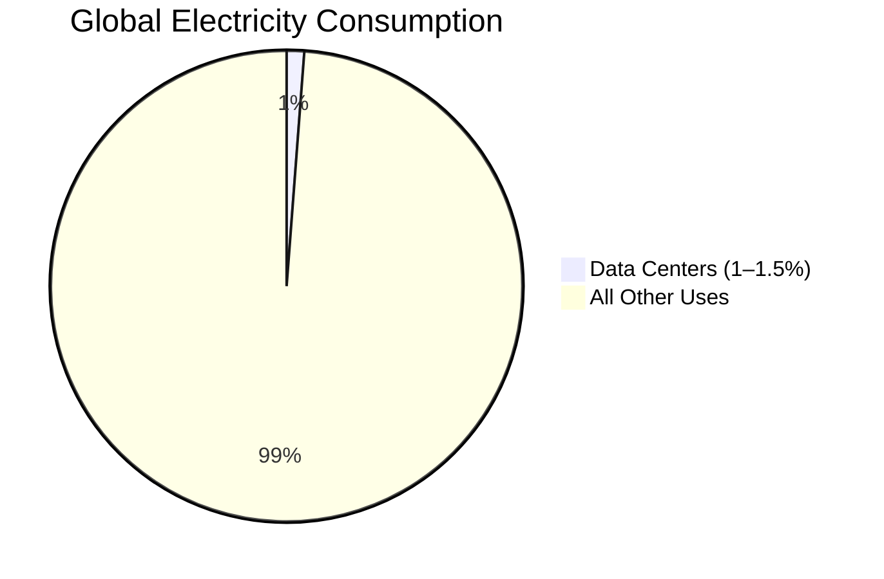
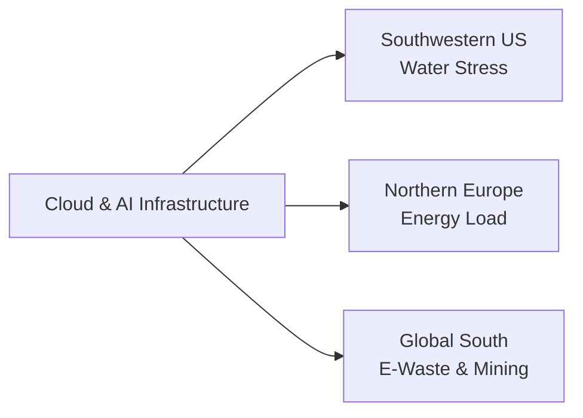

# How Suckless Made Libre Computing Feel Possible

_January 19, 2026_

Libre software used to feel like a good idea that couldn’t survive the real world. Modern systems are massive, opaque, and designed around corporate control rather than user understanding.

Then I discovered **suckless**, and libre computing started to feel possible again.

Not because suckless is a collection of apps, but because it is a **mindset**: keep things small, readable, and under your control.

---

## The Shift

Tools like **dwm**, **dmenu**, and **st** are small enough that freedom stops being abstract. You can read the code, patch what you need, and move on with your life.

There is no magic layer.  
No hidden service.  
No illusion of convenience.

Simplicity lowers the barrier to ownership.

---

## Libre Means Owning the Whole Stack

Freedom doesn’t stop at your window manager. Browsers, bootloaders, operating systems, and especially firmware decide how much control you really have.

Projects like **Libreboot** and **coreboot** exist because the lowest layers are where trust gets forced on users.

Then there is the **Intel Management Engine**: a closed subsystem running below the operating system. The **EFF** and **FSF** have explained why this matters.

As systems grow more complex and less inspectable, data extraction becomes easier to hide. Telemetry, usage patterns, and behavior quietly turn into profit.

Complexity makes surveillance cheap.

---

## Cloud and AI: Anti-Libre by Design

Cloud computing is sold as convenience, but in practice it is centralization. Your data, workflows, and compute move onto someone else’s machines. You can’t fully inspect them, you can’t fully control them, and ownership becomes a subscription.

AI pushes the same direction at a larger scale. It depends on massive datasets, constant collection, and always-on infrastructure.

It isn’t free intelligence.  
It’s industrial extraction.

---

## The Environmental Cost They Don’t Show You

Big tech presents itself as clean because the damage is off-screen. But the infrastructure is physical.

Data centers already consume over **1% of global electricity**. Cooling them increases local water stress. Rapid hardware churn creates growing mountains of e-waste. AI workloads add even more energy and water demand while profits concentrate further.

Scale makes money.  
The planet pays.

---

## Charts: Making the Cost Visible

### Global Electricity Consumption (Approx.)



_Source: International Energy Agency (IEA)_

---

### Infrastructure Impact of Cloud + AI

```mermaid
bar
    title Relative Impact of Big Tech Infrastructure
    x-axis Category
    y-axis Relative Impact
    "Energy Use" : 8
    "Water Use" : 7
    "E-Waste" : 6
    "Data Extraction" : 9
```

_Conceptual scale based on IEA, UNEP, Nature Sustainability, Scientific American._

---

## Geographic Pressure Points

The cloud is global.
The damage is local.



---

## Why Suckless Still Matters

Suckless points to a different path:

- local software instead of cloud services
- simple tools instead of AI-heavy automation
- understanding instead of abstraction

That path tends to use fewer resources, reduce forced upgrades, and remove the invisible “always-online” tax modern software assumes.

Simplicity is not nostalgia.
It is restraint.

---

## Final Thoughts

I’m not an expert.
I’m just an enthusiast.

But suckless helped me see that freedom starts small: simple tools, libre systems, and fewer hidden costs—for users and for the world around us.

---

## References

- Suckless philosophy: [https://suckless.org/](https://suckless.org/)
- dwm: [https://dwm.suckless.org/](https://dwm.suckless.org/)
- dmenu: [https://tools.suckless.org/dmenu/](https://tools.suckless.org/dmenu/)
- st: [https://st.suckless.org/](https://st.suckless.org/)
- Libreboot: [https://libreboot.org/](https://libreboot.org/)
- coreboot: [https://www.coreboot.org/](https://www.coreboot.org/)
- Intel Management Engine concerns (EFF): [https://www.eff.org/deeplinks/2017/08/intel-management-engine](https://www.eff.org/deeplinks/2017/08/intel-management-engine)
- FSF on Management Engine: [https://www.fsf.org/blogs/sysadmin/the-management-engine](https://www.fsf.org/blogs/sysadmin/the-management-engine)
- Data centers & energy (IEA): [https://www.iea.org/reports/data-centres-and-data-transmission-networks](https://www.iea.org/reports/data-centres-and-data-transmission-networks)
- Data centers & water stress (Nature Sustainability): [https://www.nature.com/articles/s41893-021-00727-4](https://www.nature.com/articles/s41893-021-00727-4)
- Global e-waste (UNEP): [https://www.unep.org/resources/report/global-e-waste-monitor-2024](https://www.unep.org/resources/report/global-e-waste-monitor-2024)
- AI environmental impact (Scientific American): [https://www.scientificamerican.com/article/ais-climate-impact-goes-beyond-its-carbon-footprint/](https://www.scientificamerican.com/article/ais-climate-impact-goes-beyond-its-carbon-footprint/)
